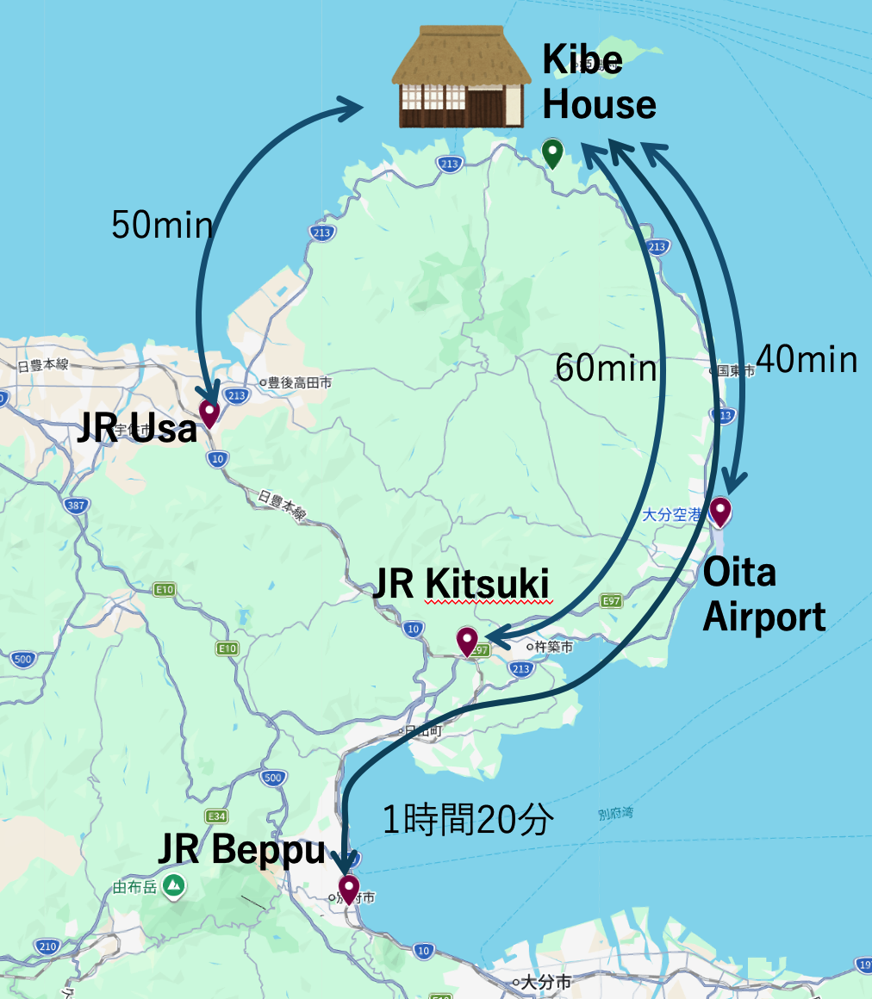

## Main Access Routes

- 40 min by car from Oita Airport
- 50 min by car from JR Usa Station
- 1 hour by car from JR Kitsuki Station
- 1 hour 20 min by car from JR Beppu Station

## Useful Spots

### Local restaurants
- Japanese diner: [Kibe Shokudo](https://map.yahoo.co.jp/v3/place/U2bd53BPxe6)
- Japanese diner: [Shiroyama-tei](https://theoita.com/syokusaiaiyou/1001/)
- Chinese: [Hira Ou](https://tabelog.com/en/oita/A4403/A440302/44014873/)
- Restaurant: [Kaen (Michi-no-Eki Kunimi)](https://visit-kunisaki.com/spot/resutoran-kaen-mitinoekikunimi/)
- Kappo dining: [Mikuniya](https://mikuni8.com/)

- Ramen & cafe: [Myojo](https://visit-kunisaki.com/spot/%E3%83%A9%E3%83%BC%E3%83%A1%E3%83%B3%E3%83%BB%E3%82%AB%E3%83%95%E3%82%A7%E6%98%8E%E6%98%9F/)
- Chuka soba: [Yamaneko](https://tabelog.com/en/oita/A4403/A440302/44011902/)
- Cafe: [Garando](https://www.city.bungotakada.oita.jp/site/showanomachi/1302.html)

### Shopping
- [Michi-no-Eki Kunimi (roadside station)](https://visit-kunisaki.com/spot/%E9%81%93%E3%81%AE%E9%A7%85%E3%81%8F%E3%81%AB%E3%81%BF/)
- Convenience store: Lawson
- Supermarket: [Kakaji](https://www.google.com/maps/place/%E3%82%B9%E3%83%BC%E3%83%91%E3%83%BC%E3%81%8B%E3%81%8B%E3%81%A2/@33.6684606,131.5257045,17z/data=!3m1!4b1!4m6!3m5!1s0x35446bf4b103f51f:0x160590effc5b1515!8m2!3d33.6684606!4d131.5257045!16s%2Fg%2F1tf7vj4t)
- Supermarket: [Marushoku](https://www.sunlive.co.jp/shop/%E3%83%9E%E3%83%AB%E3%82%B7%E3%83%A7%E3%82%AF%E5%9B%BD%E6%9D%B1%E5%BA%97/)
- Discount store & supermarket: [Atax](https://map.yahoo.co.jp/v3/place/PVZEtSdK5VM)
- Supermarket: [Asano](https://ptl.zchain.co.jp/store/7480?store_group_id=1)

### Hot springs
- [Ebisudani Onsen](https://www.ebisudani-spa.planning-support.ks-rondo.net/)
- [Horai-no-Sato Sennin-yu](https://www.city.bungotakada.oita.jp/site/showanomachi/1280.html)
- [Matama Onsen](https://www.spaland.jp/)
