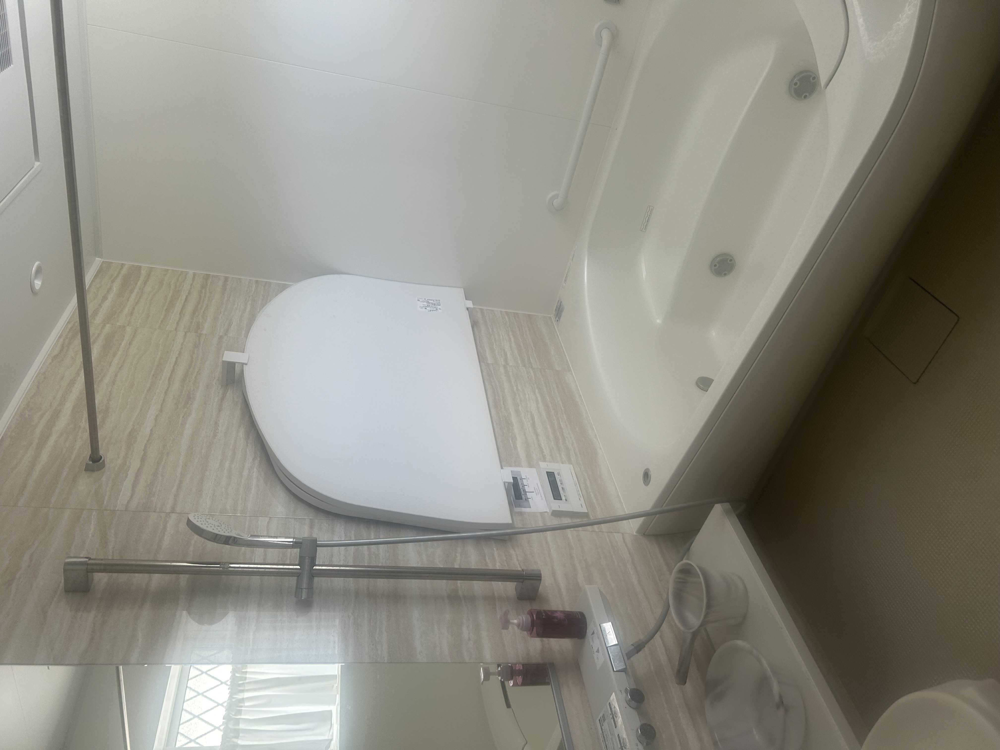
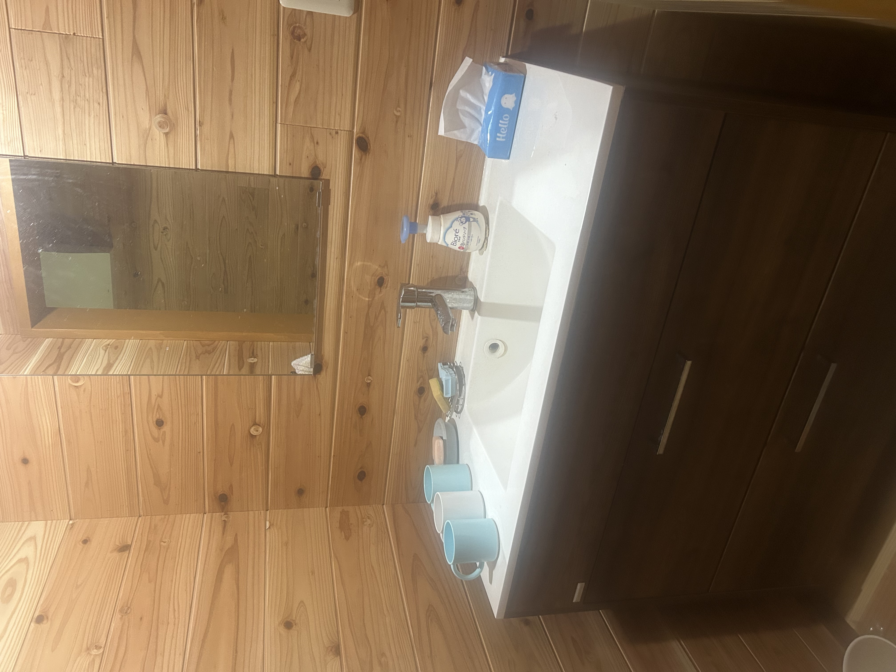
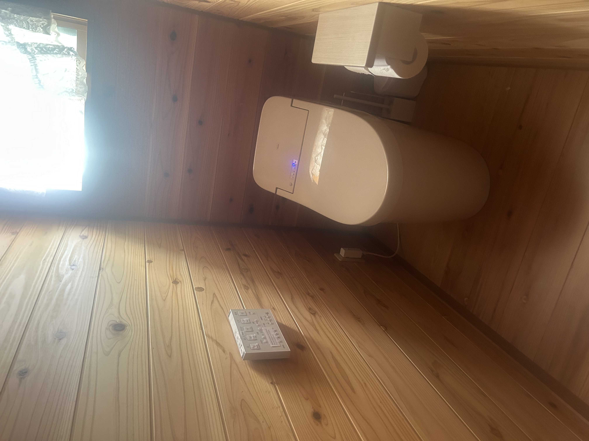
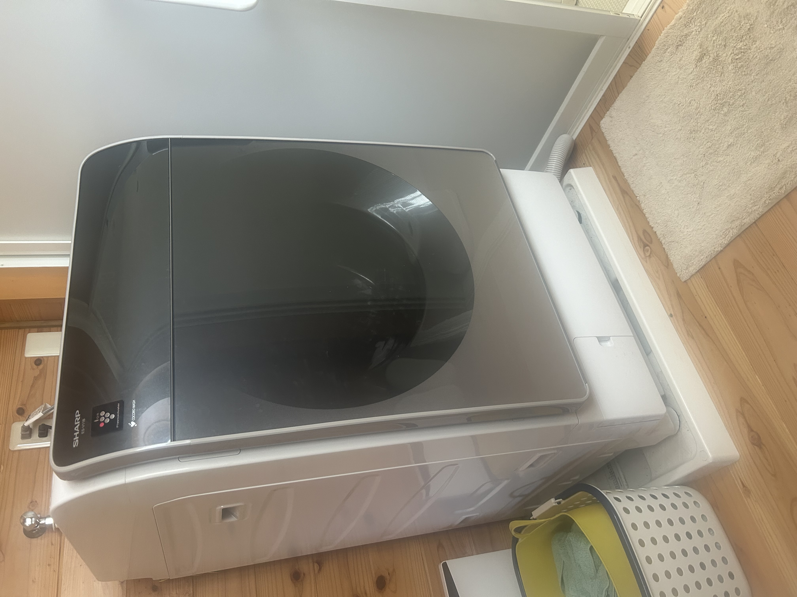

## About the House

On the first floor there are a living room, a dining room, and a kitchen,
along with two tatami rooms and one wooden-floored bedroom.
A toilet, bath, and washroom are also on this floor, which serves as the guest space.
The second-floor loft is reserved for the hosts.

Guests are welcome to use most of the first floor.
As this is a homestay-style lodging, the loft and part of the first floor
are reserved for the owners, and the kitchen and washroom are shared with them.

For sleeping, you can use the two tatami rooms and the bedroom with beds.

The kitchen is stocked with basic cookware, tableware, and seasonings —
please feel free to use them.

A bath, washroom, toilet, and washing machine are available.

