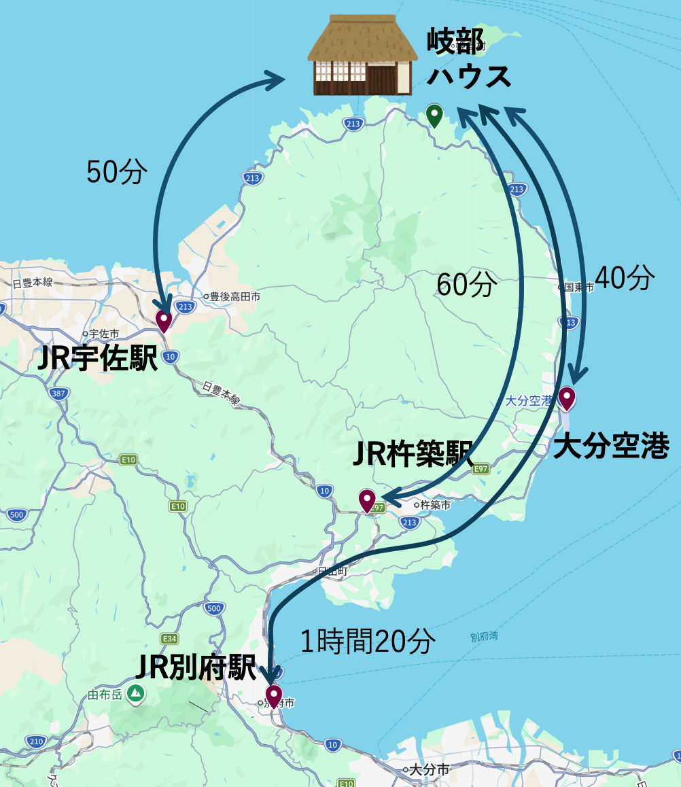

## 主なアクセス

- 大分空港から車で40分
- JR宇佐駅から車で50分
- JR杵築駅から車で一時間
- JR別府駅から車で1時間20分

## 便利スポット

### 地域の飲食店
- お食事処：[キベ食堂](https://map.yahoo.co.jp/v3/place/U2bd53BPxe6)
- お食事処：[城山亭](https://theoita.com/syokusaiaiyou/1001/)
- 中華：[平王](https://tabelog.com/oita/A4403/A440302/44014873/)
- レストラン：[嘉宴（道の駅くにみ）](https://visit-kunisaki.com/spot/resutoran-kaen-mitinoekikunimi/)
- 割烹：[三國屋](https://mikuni8.com/)

- ラーメン・カフェ：[明星](https://visit-kunisaki.com/spot/%E3%83%A9%E3%83%BC%E3%83%A1%E3%83%B3%E3%83%BB%E3%82%AB%E3%83%95%E3%82%A7%E6%98%8E%E6%98%9F/)
- 中華そば：[山猫](https://tabelog.com/oita/A4403/A440302/44011902/)
- 喫茶：[瓦藍洞](https://www.city.bungotakada.oita.jp/site/showanomachi/1302.html)

### 買い物スポット
- [道の駅くにみ](https://visit-kunisaki.com/spot/%E9%81%93%E3%81%AE%E9%A7%85%E3%81%8F%E3%81%AB%E3%81%BF/)
- コンビニ：ローソン
- スーパー：[かかぢ](https://www.google.com/maps/place/%E3%82%B9%E3%83%BC%E3%83%91%E3%83%BC%E3%81%8B%E3%81%8B%E3%81%A2/@33.6684606,131.5257045,17z/data=!3m1!4b1!4m6!3m5!1s0x35446bf4b103f51f:0x160590effc5b1515!8m2!3d33.6684606!4d131.5257045!16s%2Fg%2F1tf7vj4t)
- スーパー：[マルショク](https://www.sunlive.co.jp/shop/%E3%83%9E%E3%83%AB%E3%82%B7%E3%83%A7%E3%82%AF%E5%9B%BD%E6%9D%B1%E5%BA%97/)
- ディスカウントショップ、スーパー：[アタックス](https://map.yahoo.co.jp/v3/place/PVZEtSdK5VM)
- スーパー：[あさの](https://ptl.zchain.co.jp/store/7480?store_group_id=1)

### 温泉・観光スポット

#### 温泉
- [夷谷温泉](https://www.ebisudani-spa.planning-support.ks-rondo.net/)
- [ほうらいの里仙人湯](https://www.city.bungotakada.oita.jp/site/showanomachi/1280.html)
- [真玉温泉](https://www.spaland.jp/)

#### 観光スポット
- [旧千燈寺跡・五辻不動・アントニーゴームリー像](/jp/sentoji-map/)
- [国東半島 観光マップ](/jp/kunisaki-map/)

　